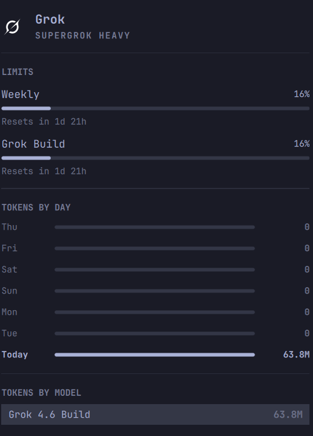

# omarchy-agent-usage-grok

Grok and Cursor usage collectors for the [Omarchy](https://omarchy.org/) agents bar.

<p align="left">
  
</p>

Omarchy already ships collectors for Claude, Codex, and Fireworks. Grok is a
first-party default coding agent, but `omarchy-agent-usage-update` never
discovers it, so the bar stays empty for SuperGrok. This repo is that missing
`omarchy-agent-usage-grok` command, plus `omarchy-agent-usage-cursor` for
Cursor Pro monthly pools: both print the same JSON record the stock
`omarchy.agents` panel already understands.

That is the Claude / Codex path. Adding an agent never touches the panel —
ship a collector, drop `~/.local/state/omarchy/agents/usage/<id>.json`, and
the robot icon gains a tab. Compact stacked meters on the bar itself need a
change to the built-in agents widget, so they live in a
**[separate package](https://github.com/MahdiHedhli/omarchy-usage-grok-bar)**
rather than a second icon here.

Documented with [GitHub Spec Kit](https://github.com/github/spec-kit).
Governing principles live in `.specify/memory/constitution.md`. The feature
spec, plan, and tasks are under `specs/001-grok-usage-collector/`.

## What it shows

- Local token stats from `$GROK_HOME/sessions` (default `~/.grok`) billed
  `turn_completed` rows in `updates.jsonl` (skips subagent sessions and
  synthetic `task-completed` prompt ids)
- SuperGrok weekly (or monthly) pool, leftover prepaid credits, and
  grok.com product split (**Grok Build / Chat / Imagine / Voice**) as extra
  meters the stock panel already draws (`kind: product`, so a separate bar
  chip can paint them as a segmented weekly track)
- Limits from Grok ACP `_x.ai/billing`, with the same CLI-proxy
  `cli-chat-proxy.grok.com` billing endpoint `/usage` uses as a fallback
- pi / omp (`xai`, `xai-auth`, `xai-oauth`) and OpenCode (`providerID=xai`)
  sessions that burned the same subscription
- **Cursor Pro** monthly **Cursor Models** / **Other Models** pools (and the
  Grok Bot weekly pool when that account has one) as a second tab, the same
  way Claude and Codex appear

The panel watches `~/.local/state/omarchy/agents/usage/grok.json` and
`cursor.json`. Left-click the agents icon; right-click still launches your
default agent. Cursor stays hidden until you are signed in to Cursor.

`install.sh` also clones stock `omarchy.agents` (QML unchanged) and drops
`assets/grok.svg` there so the Grok tab uses the same mark convention as
Claude and Codex. The menubar robot glyph is untouched. Until Omarchy
packages those assets, that clone is the user-space overlay.

To hide a tab after it has data:

```bash
omarchy bar set omarchy.agents providers '{
  "claude": { "enabled": true },
  "codex": { "enabled": true },
  "fireworks": { "enabled": true },
  "grok": { "enabled": true },
  "cursor": { "enabled": false }
}' --json
```

## Install on Omarchy

```bash
./test/agent-usage-grok-scanner-test.sh
./test/agent-usage-cursor-test.sh
./install.sh
```

`install.sh` copies the collectors to `~/.local/bin`, writes `grok.json` and
`cursor.json`, and enables a 15-minute systemd user timer. Packaged
`omarchy-agent-usage-update` only globs `$OMARCHY_PATH/bin`, so the timer is
what keeps the tabs fresh until Omarchy ships the collectors.

```bash
./install.sh --uninstall
```

## Run once

```bash
./bin/omarchy-agent-usage-grok --force | jq .
./bin/omarchy-agent-usage-cursor --force | jq .
```

## Tests

```bash
./test/agent-usage-grok-scanner-test.sh
./test/agent-usage-cursor-test.sh
```

Fixture-only: no live xAI or Cursor network. Grok tests cover nested and
flat turns, cache split, subagent skip, cents-vs-dollars prepaid,
pi/omp/OpenCode merge, and cache behavior. Cursor tests cover the empty
unsigned record and mapping Cursor Models / Other Models / Grok Bot onto
`limits[]`.

## Related marketplace plugins

plugins.omarchy.org already lists several Grok usage widgets. This repo stays
a **collector** for stock `omarchy.agents` (no second bar icon). Features
borrowed from those listings:

| Plugin | What we took |
|---|---|
| [calmasacow.grok-usage](https://github.com/calmasacow/omarchy-grok-usage) | Product split meters (Build / Chat / Imagine), skip `task-completed` ids, CLI-proxy billing, same-origin redirects |
| [dougfour.grok-usage](https://github.com/dougfour/omarchy-grok-usage) | Grok Build / Chat / Imagine as segments of the weekly pool |
| [vt.grok-usage](https://github.com/vitally/omarchy-grok-usage) | Headless service that only writes `grok.json` |
| [rlimberger.grokbar-omarchy](https://github.com/rlimberger/grokbar-omarchy) | Reset timestamp, weekly pool, and optional Cursor monthly pools |

We did **not** copy account email, token refresh write-back, or a forked QML
panel. Those belong in a widget, not in the usage record. The compact
menubar meters are
[omarchy-usage-grok-bar](https://github.com/MahdiHedhli/omarchy-usage-grok-bar)
because they cannot land upstream without changing the built-in agents widget.

## Upstream

The collectors are drop-ins for `omacom/omarchy`
(`bin/omarchy-agent-usage-grok`, `bin/omarchy-agent-usage-cursor`, plus
optional `shell/plugins/agents/assets/grok.svg` / `grok-light.svg` and
`providers.grok` / `providers.cursor` in the agents manifest). Several open
PRs already cover the Grok gap (`#7200`, `#6902`, …). This repo is the
standalone, installable form with omp `xai-oauth` included.

## Sharing

- Widget screenshot: [`docs/screenshot.png`](docs/screenshot.png)
- Open Graph card (1200×630): [`docs/og.png`](docs/og.png)
- GitHub social preview (1280×640): [`docs/social-preview.png`](docs/social-preview.png)

GitHub has no API for the repo social preview. Upload `docs/social-preview.png` at
[Settings → Social preview](https://github.com/MahdiHedhli/omarchy-agent-usage-grok/settings).

## License

MIT
